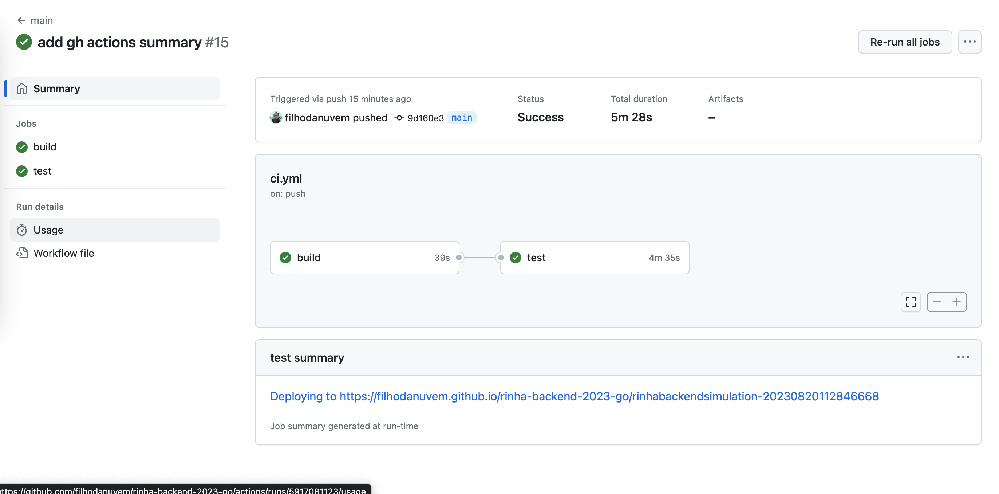

# rinha-backend-2023-go

Repositório de exemplo pro desafio da [Rinha de Backend 2023 Q3](https://github.com/zanfranceschi/rinha-de-backend-2023-q3)

# GitHub Actions + GitHub Pages deploy

⚠️ Aconselho a deixar o repositório público antes de seguir esse tutorial, já que os testes demoram minutos pra rodar e o github impõe um limite de tempo de execução para repos privados, [leia mais aqui](https://docs.github.com/en/actions/learn-github-actions/usage-limits-billing-and-administration). 

* Passo 1) Crie uma branch chamada "gh-pages" onde os assets do site vão ficar. Copie [esse arquivo](https://github.com/filhodanuvem/rinha-backend-2023-go/blob/gh-pages/.github/workflows/ci.yml) para essa branch como `.github/workflows/ci.yml`.  
* Passo 2) Acessar a aba settings do seu repositório, no menu esquerda entrar em "Pages" e habilitar o Gihub Pages em "Build and deployment" com Source "Deploy from a branch" e selecione a branch `gh-pages` que acabou de criar. 
* Passo 3) Na sua branch `main` crie o arquivo `.github/workflows/ci.yml` e copie o conteúdo [desse arquivo](https://github.com/filhodanuvem/rinha-backend-2023-go/blob/9d160e39292b66d6c53cf4a761028794bd8a90b8/.github/workflows/ci.yml) para ele. 

Toda vez que você commitar na branch `main`, a pipeline vai tentar fazer um `docker build` como validação e então rodar os testes e fazer commit do report do gatling para branch `gh-pages`.

Esse commit vai gerar uma nova url no GH Pages que você pode acessar através da página Summary da execução da pipeline.

O site pode demorar um pouco a ficar disponível já que essa segunda pipeline do GH pages precisa rodar. Você pode acessar a aba actions do repositório pra entender se todos os jobs rodaram com sucesso. 
